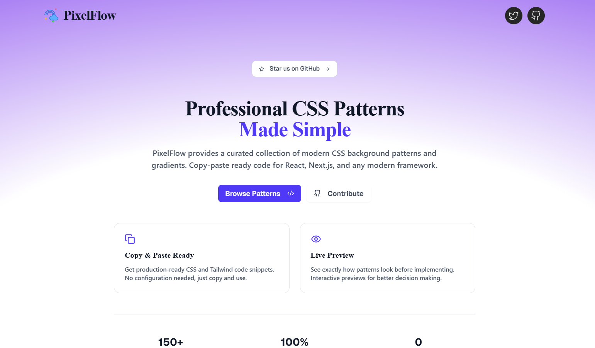
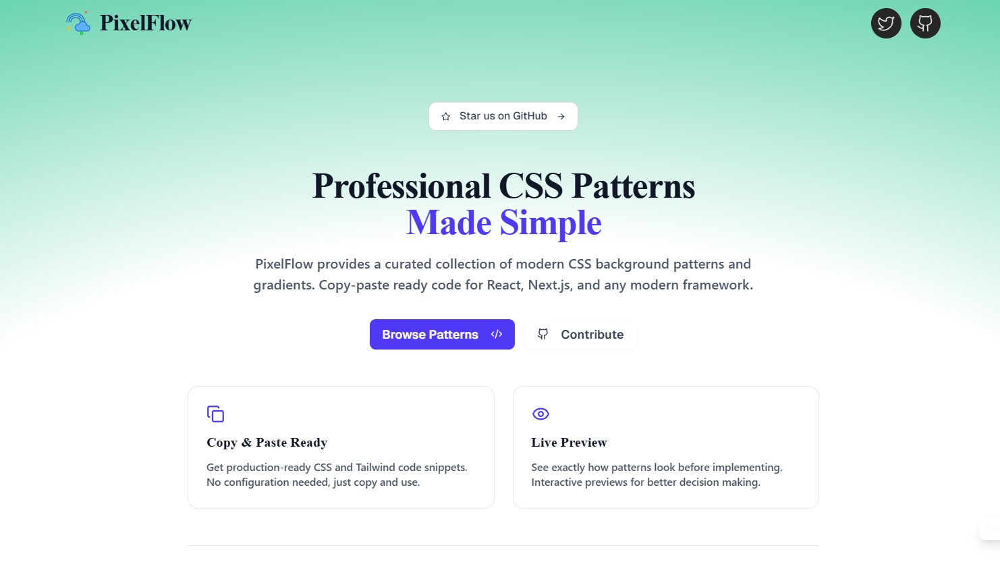
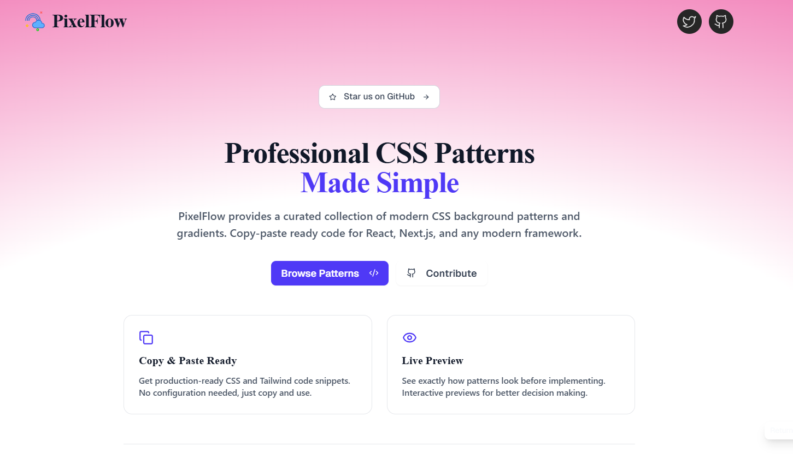
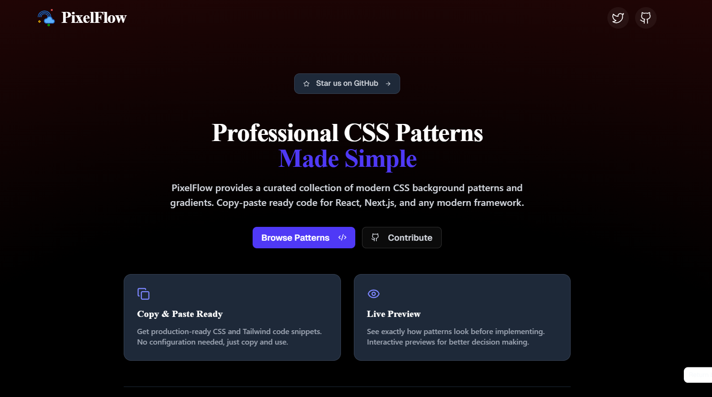
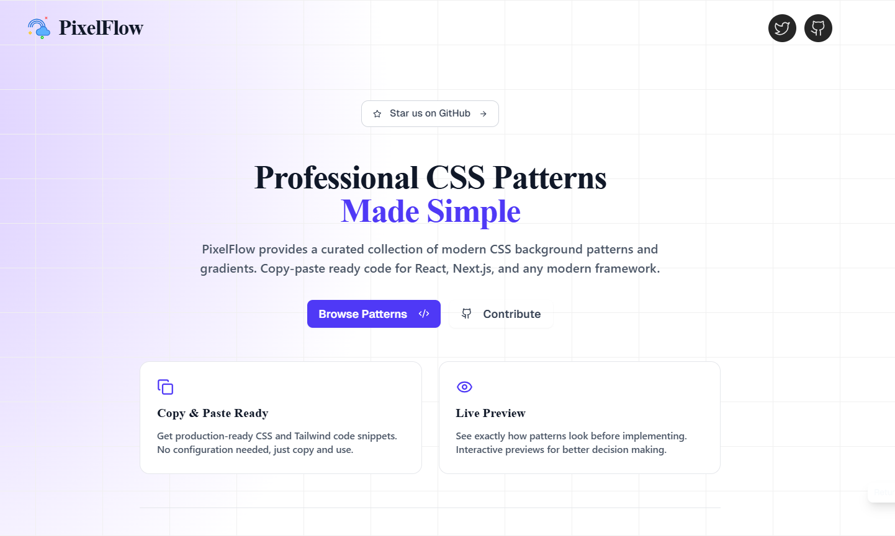
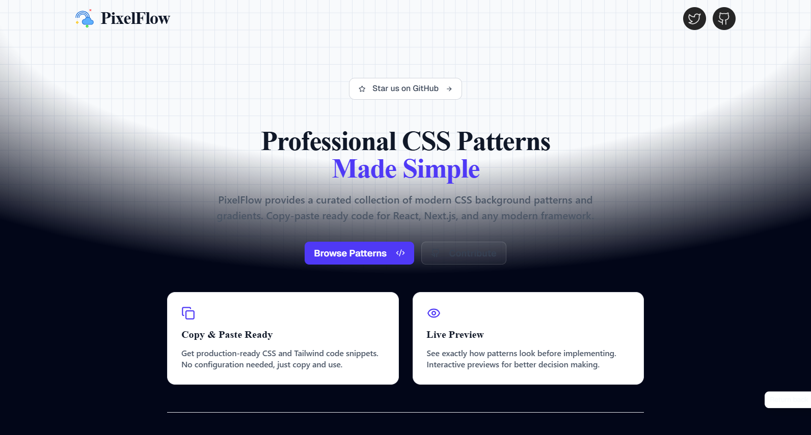
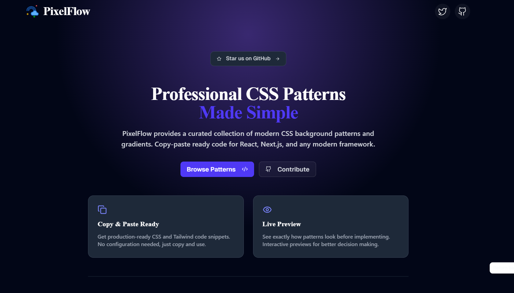
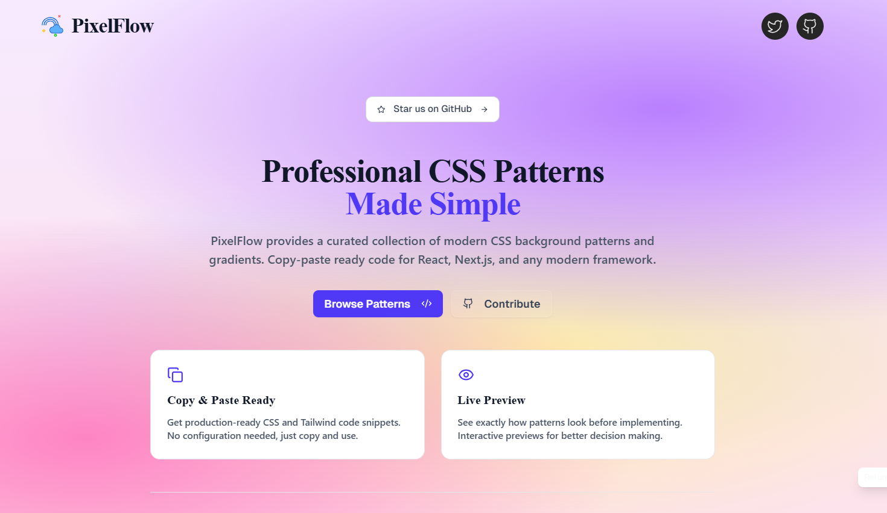

# PixelFlow

> _**For developers, by a developer. Design that flows⚡**_

<div align="center">
  
  <br><br>
  <p align="left">
    <strong>Effortlessly enhance your websites and apps with 150+ modern CSS background patterns and gradient snippets.</strong>
    Instantly copy and paste beautifully crafted, production-ready designs built with modern CSS and Tailwind CSS for seamless integration.<br>
    </br>
    <em>Ideal for developers and designers working with React, Next.js, Vue, Angular, or any modern frontend framework. Made for devs who appreciate flowing design.</em>
    </br>
  </p>
  <br>
  <p align="center">
    


    
  </p>
</div>

---


  <p align="center">
<a href="https://vercel.com/oss">

</a>
</p>

## Visit: **[PixelFlow](https://pixelflow.dev)**










> _**Note: This project does not provide plain HTML or vanilla CSS snippets. All code is optimized for JSX (React/Next.js) and Tailwind CSS.**_  
> [Learn more in this announcement.](https://github.com/shivas1432/PixelFlow/discussions/1)

## PixelFlow in the Wild!!!

<p align="left"> 
Curious where PixelFlow is getting featured, shared, talked about or appreciated? 
</br>
Check out this growing list of shoutouts, showcases, and love from the community:  
</br>

⚡[**Where PixelFlow is Making Waves??**](https://pixelflow.notion.site/Where-PixelFlow-is-Making-Waves)
</p>

## Features

- **Ready-to-use CSS code** - Copy and paste directly into your projects
- **Live preview** - See patterns in action before implementation
- **Modern design** - Crafted with contemporary CSS techniques and Tailwind CSS
- **Responsive patterns** - Optimized for all screen sizes
- **Zero dependencies** - Pure CSS implementations
- **Pattern categories** - Organized collection for easy browsing
- **Return back to scroll** - Smooth navigation experience
- **Add to favorites** - Save your preferred patterns
- **Customizable snippets** - Easily modify patterns to fit your needs
- **Flowing animations** - Smooth transitions and micro-interactions

## Tech Stack

- **Next.js 15** - React framework with App Router
- **TypeScript** - Type-safe development
- **Tailwind CSS** - Utility-first CSS framework
- **Vercel** - Deployment and hosting

## Sponsored by <a href="https://vercel.com/oss">Vercel⚡</a>

**This project is proudly powered by <b>Vercel</b>. The platform behind PixelFlow's blazing-fast deployment and seamless scalability.**<br>

<i>Big thanks to Vercel for supporting open source and keeping this project running smoothly!</i>
<br><br>
<a href="https://vercel.com/oss">

</a>

## Getting Started

### Prerequisites

- Node.js 18+
- npm, yarn, pnpm, or bun

### Installation

1. Clone the repository:

```bash
git clone https://github.com/shivas1432/PixelFlow.git
cd PixelFlow
```

2. Install dependencies:

```bash
npm install
# or
yarn install
# or
pnpm install
```

3. Run the development server:

```bash
npm run dev
# or
yarn dev
# or
pnpm dev
```

4. Open [http://localhost:3000](http://localhost:3000) in your browser

### Build for Production

```bash
npm run build
npm start
```

## How to Use This

1. Visit the live site: **[https://pixelflow.dev](https://pixelflow.dev)**
2. Browse through the collection of background patterns and gradients.
3. Click on any pattern to open its preview modal.
4. Copy the CSS/Tailwind-compatible code snippet.
5. Paste it into your project wherever needed — it's responsive, clean, and ready to flow!

These snippets work great for:

- Hero sections
- Landing pages
- Cards and sections
- Background art
- UI animations

## Customization

### Manual Pattern Customization

You can easily customize any background pattern by modifying the pattern object structure. Each pattern follows this format:

```typescript
{
  id: "unique-pattern-id",
  name: "Pattern Display Name",
  badge: "New",
  style: {
    background: "#ffffff",
    backgroundImage: `
      // Your CSS background patterns here
      linear-gradient(to right, #f0f0f0 1px, transparent 1px),
      radial-gradient(circle 800px at 100% 200px, #d5c5ff, transparent)
    `,
    backgroundSize: "96px 64px, 100% 100%",
  },
  code: `<div className="min-h-screen w-full bg-white relative">
  {/* Pattern Name Background */}
  <div
    className="absolute inset-0 z-0"
    style={{
      backgroundImage: \`
        // Your background image styles
      \`,
      backgroundSize: "96px 64px, 100% 100%",
    }}
  />
  {/* Your Content/Components */}
</div>`,
}
```

### Customization Tips

**Colors**: Change hex values in `backgroundImage` gradients
**Sizing**: Modify `backgroundSize` values for different scales
**Positioning**: Adjust gradient positions and directions
**Effects**: Add multiple background layers for complex patterns
**Flow**: Create smooth transitions between pattern states

### Example Customization

```typescript
// Original pattern
backgroundImage: `linear-gradient(to right, #f0f0f0 1px, transparent 1px)`;

// Customized flowing version
backgroundImage: `linear-gradient(45deg, #3b82f6 1px, transparent 1px)`; // Diagonal blue lines
backgroundSize: "48px 32px"; // Smaller grid with flow
```

## Usage

1. Browse the pattern collection on the website
2. Click on any pattern to see the live preview
3. Use the "Add to Favorites" feature to save patterns you like
4. Copy the generated CSS code
5. Paste it into your project and watch it flow

Each pattern includes:

- Complete CSS styling
- Tailwind-compatible code
- Responsive implementation
- Cross-browser compatibility
- Smooth animations

## Contributing

> **This project is sponsored by Vercel, which helps us maintain a stable development environment.**

We welcome contributions to expand the pattern collection. To add new flowing patterns:

### Adding New Patterns

1. Fork the repository
2. Create a feature branch:

```bash
git checkout -b feature/new-flowing-pattern
```

3. Navigate to `src/app/utils/patterns.ts`
4. Add your pattern following the established format:

```typescript
{
  id: "unique-pattern-id",
  name: "Pattern Display Name",
  badge: "New", // Optional: "New", "Popular", "Flow"
  style: {
    background: "#ffffff",
    backgroundImage: `
      // Your CSS background patterns here
      linear-gradient(to right, #f0f0f0 1px, transparent 1px),
      radial-gradient(circle 800px at 100% 200px, #d5c5ff, transparent)
    `,
    backgroundSize: "96px 64px, 100% 100%",
  },
  code: `<div className="min-h-screen w-full bg-white relative">
  {/* Pattern Name Background */}
  <div
    className="absolute inset-0 z-0"
    style={{
      backgroundImage: \`
        // Your background image styles
      \`,
      backgroundSize: "96px 64px, 100% 100%",
    }}
  />
  {/* Your Content/Components */}
</div>`,
}
```

### Contribution Guidelines

- **Consistency**: Follow the existing pattern structure exactly
- **Naming**: Use descriptive, kebab-case IDs and proper display names
- **Quality**: Ensure patterns are visually appealing and have smooth flow
- **Performance**: Optimize for rendering performance
- **Responsiveness**: Test patterns across different screen sizes
- **Uniqueness**: Avoid duplicating existing patterns
- **Flow**: Consider adding subtle animations or transitions

### Pattern Categories

Consider these categories when adding patterns:

- **Gradient Flow** - Smooth color transitions and animated blends
- **Geometric Flow** - Moving grids, dots, lines, shapes
- **Decorative Flow** - Subtle animated background textures
- **Minimal Flow** - Clean and simple flowing designs

### Testing Your Patterns

1. Test the pattern in the development environment
2. Verify responsive behavior and smooth animations
3. Check browser compatibility (Chrome, Firefox, Safari, Edge)
4. Ensure code validity and formatting
5. Test performance impact of animations

### Pull Request Process

1. Commit your changes with descriptive messages
2. Push to your feature branch
3. Create a pull request with:
   - Clear description of the pattern added
   - Screenshots or preview of the pattern
   - Any special considerations or notes

```bash
git add .
git commit -m "feat: add new flowing geometric grid pattern"
git push origin feature/new-flowing-pattern
```

## Development

### Project Structure

```
PixelFlow/
src/
├── app/                   
│   ├── globals.css       
│   ├── layout.tsx        
│   ├── page.tsx           
│   └── not-found.tsx      
│
├── components/           
│   ├── ui/                # shadcn/ui components
│   │   ├── badge.tsx     
│   │   ├── button.tsx     
│   │   └── tabs.tsx       
│   ├── layout/            
│   │   ├── navbar.tsx     
│   │   └── footer.tsx     
│   ├── patterns/          
│   │   ├── pattern-showcase.tsx     
│   │   ├── pattern-card.tsx        
│   │   ├── pattern-grid.tsx         
│   │   └── pattern-empty-state.tsx 
│   ├── home/             
│   │   ├── hero.tsx               
│   │   ├── support-dropdown.tsx   
│   │   └── return-to-preview.tsx  
│   └── providers/         
│       └── theme-provider.tsx 
│
├── lib/                   
│   ├── utils.ts           
│   └── constants.ts      
│
├── hooks/                 
│   ├── useTheme.tsx       
│   └── useCopy.tsx        
│
├── types/                 
│   ├── pattern.ts         
│   └── index.ts           
│
├── context/               
│   └── favourites-context.tsx 
│
└── data/                 
    ├── patterns.ts        # Pattern used in UI (contribute here)
    └── categories.ts      
```

### Code Standards

- Use TypeScript for type safety
- Follow ESLint and Prettier configurations
- Maintain consistent code formatting
- Use semantic commit messages
- Consider performance impact of animations

## License

This project is open source and available under the [MIT License](LICENSE).

## Acknowledgments

- Built with Next.js and Tailwind CSS
- Inspired by modern flowing web design patterns
- Community-driven pattern collection
- Special thanks to the open source community

## Support

For questions, issues, or suggestions:

- Open an issue on GitHub
- Check existing issues before creating new ones
- Provide detailed information for bug reports

## Built By

- **Kanugula Shivashanker**
- GitHub: [@shivas1432](https://github.com/shivas1432)
- LinkedIn: [shivashanker-kanugula](https://www.linkedin.com/in/shivashanker-kanugula-51a512252)
- Instagram: [@ss_web_innovations](https://instagram.com/ss_web_innovations)
- Website: [https://www.shivashanker.com](https://www.shivashanker.com)
- Telegram: [@helpme_coder](https://t.me/helpme_coder)

If you like this project, consider giving it a ⭐️ on GitHub and sharing it with others!

---

> _**Happy flowing!**_
